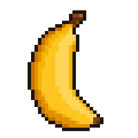
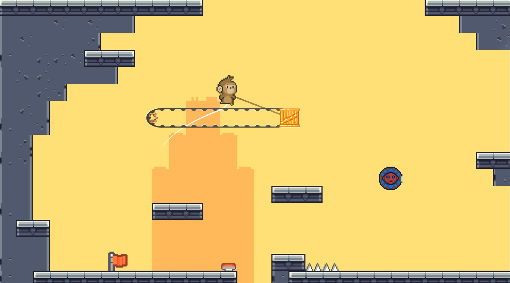
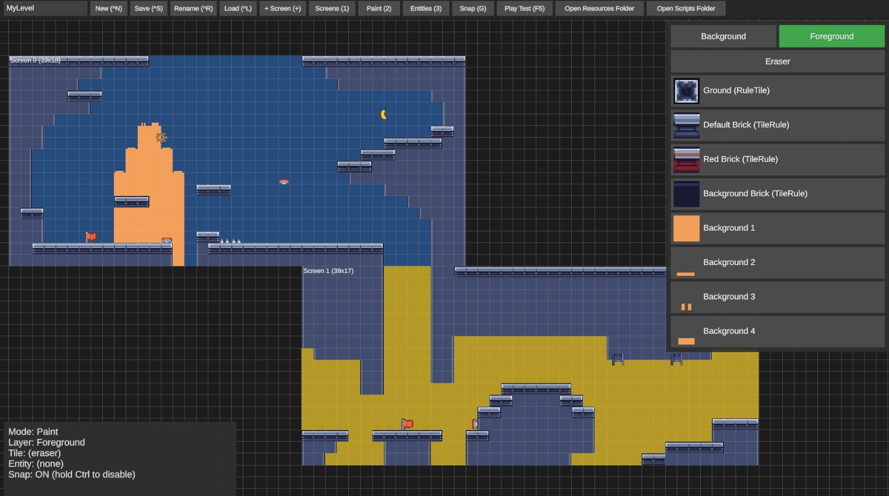

<div align="center">



# Tailbound
### 2D Platformer with Runtime Level Editor and Modding


</div>


A 2D precision platformer where you play a monkey who **swings by his tail**. 
Grab onto anything grabbable, build up momentum, and let go at the right moment to launch yourself across the gap. The game also ships with a **built-in level editor** and a 
**MiniScript modding layer**, so you can build your own levels and invent your own gadgets.

## Screenshots

### In-game
<div align="center">


</div>

### Editor
<div align="center">


</div>

## Features

### Gameplay
- **Tail-swinging traversal** — hold a button in the air and your tail latches onto the best attachable object in range; swing back and forth, then release to be flung with a speed boost in the direction you're holding.
- **Wall climbing with stamina** — cling to walls, climb them, wall-jump off them and mantle over ledges, all limited by a stamina meter that flashes red when you're about to drop.
- **Forgiving platforming** — coyote time and jump buffering make jumps feel fair.
- **Room-by-room levels** — the world is split into screens; the camera locks to the room you're in and glides to the next when you cross the edge.
- **Hazards and gadgets** — spikes, springs, timed and accelerating ziplines, and collectible bananas that tag along behind you until you land safely.
- **Death and respawn** — touch spikes or fall out of a room and you respawn at the room's spawn point or last checkpoint, with a quick screen wipe.

### Level editor
- **Three editing modes**: *Screens* (create, move and resize rooms on a grid; rooms can't overlap), *Paint* (Background and Foreground tile layers), and *Entities* (place, move and tweak gadgets).
- **Autotiling** — Unity Rule Tiles are evaluated live while you paint, including across the borders between neighbouring rooms.
- **Snap to grid** with one key (hold <kbd>Ctrl</kbd> to temporarily invert it), a cursor preview that shows exactly where a tile or entity will land, and cursor-anchored zoom.
- **Per-entity inspector** — every placed gadget exposes editable properties (e.g. a spring's direction), highlights the ones you've overridden, and lets you reset them.
- **One-key play test** — press <kbd>F5</kbd> to jump straight into your level and <kbd>Esc</kbd> to come back to the editor.
- **Plain-file levels** — levels are saved as readable JSON files you can share.

### Modding with MiniScript
- Create a brand-new gadget from inside the editor ("New Script Entity"). It's backed by a [MiniScript](https://miniscript.org) file that opens in your text editor, and **edits are picked up live while you play test** — no restarts.
- Scripts can move, recolor and re-skin their entity, set colliders, play sounds, read and push the player, kill the player, and react to collisions and triggers (`start`, `update`, `onCollisionEnter`, `onTriggerEnter`, ...).
- `expose("Speed", 3.0)` turns any script variable into a property you can edit per-instance in the editor's inspector.
- Drop your own **PNG sprites and WAV sounds** into the mod folder and refer to them from scripts — no rebuild required.

A small example, from `Assets/Scripts/LevelEditor/ScriptBehaviors/Examples/Blinker.ms`:

```
speed = expose("Speed", 3.0)

start = function()
    setSprite "Textures/Spring/spring-1"
    setCollider 1, 1/7, 1
    globals.origin = getPosition
end function

t = 0
update = function()
    globals.t += deltaTime
    setPosition globals.origin[0], globals.origin[1] + sin(globals.t * 5)
end function
```

## How to play

### Controls

| Action | Key |
| --- | --- |
| Move | <kbd>←</kbd> <kbd>→</kbd> |
| Jump | <kbd>C</kbd> |
| Use tail — hold in the air to attach, release to let go | <kbd>C</kbd> |
| Aim the tail / steer the launch | <kbd>←</kbd> <kbd>→</kbd> <kbd>↑</kbd> <kbd>↓</kbd> |
| Climb (hold while pushing towards a wall) | <kbd>Z</kbd> |
| Climb up / down | <kbd>↑</kbd> <kbd>↓</kbd> while climbing |

### Moving around
1. **Run and jump** with the arrow keys and <kbd>C</kbd>. Jump height is variable — release early for a shorter hop.
2. **Swing.** While in the air, hold <kbd>C</kbd>. Your tail grabs an attachable object within reach; if several are in range, hold a direction to pick the one that way, otherwise the closest is used. Press <kbd>←</kbd>/<kbd>→</kbd> to pump the swing — you gain the most force when passing directly beneath the anchor.
3. **Let go to launch.** Release <kbd>C</kbd> to detach. The direction you're holding at that moment adds a speed boost on top of your swing, so timing and aim decide how far you fly.
4. **Climb.** Face a wall, hold <kbd>Z</kbd> and use <kbd>↑</kbd>/<kbd>↓</kbd> to scale it. Climbing drains stamina (extra when moving); it refills when you touch the ground. Jump off the wall to leap away, or climb past the top for a little ledge boost.

### Gadgets
- **Springs** — bounce you in the direction they face.
- **Spikes** — instant respawn. They come in rows of various lengths and orientations.
- **Ziplines** — grab one with your tail and it carries you along its track; timed variants send you at a fixed pace, accelerating ones build speed.
- **Bananas** — touch one and it floats after you. Land on solid ground and stay put for a moment to bank it; die first and it flies back to where it started.
- **Checkpoints** — walking through one makes the nearest spawn point in the room your respawn point.

### Using the level editor

| Action | Key |
| --- | --- |
| New / Save / Rename / Load level | <kbd>Ctrl</kbd>+<kbd>N</kbd> / <kbd>S</kbd> / <kbd>R</kbd> / <kbd>L</kbd> |
| Screens / Paint / Entities mode | <kbd>1</kbd> / <kbd>2</kbd> / <kbd>3</kbd> |
| Add a screen | <kbd>+</kbd> |
| Toggle snap to grid (hold <kbd>Ctrl</kbd> to invert) | <kbd>G</kbd> |
| Delete selected entity (Entities mode) or screen | <kbd>Delete</kbd> / <kbd>Backspace</kbd> |
| Pan | Right mouse button drag |
| Zoom | Mouse wheel |
| Play test the current level / return to the editor | <kbd>F5</kbd> / <kbd>Esc</kbd> |

#### Workflow:  
1. Add a screen
2. Switch to **Paint** and draw the ground on the Foreground layer
3. Switch to **Entities** and place a **Spawn Point** (every room requires one) plus anything else you like
4. Hit <kbd>F5</kbd>.

Levels, new entity types and mod content live in the game's data folder (on Windows, `%USERPROFILE%\AppData\LocalLow\Electric Peel\Tailbound\`):

| Folder | Contents |
| --- | --- |
| `Levels/` | Saved levels (`.json`) |
| `Entities/` | Script entities you created (`.ms` source + definition) |
| `Resources/` | Loose sprites (PNG/JPG) and sounds (WAV) available to your scripts |

## Getting started (from source)

```bash
git clone https://github.com/Bezeram/Tailbound.git
```

1. Install **Unity 6000.5.3f1** through Unity Hub.
2. Add the cloned folder in Unity Hub and open it. The first import takes a while.
3. Open `Assets/Scenes/LevelEditor.unity` and press Play to use the editor, or `Assets/Scenes/Start Menu.unity` for the campaign.
4. To make a standalone build: *File → Build Profiles*, make sure `LevelEditor` and `PlayTest` are in the scene list then build.

## Project layout

```
Assets/
  Scenes/                    Start Menu, Level_1, LevelEditor, PlayTest, ...
  Scripts/
    Player/                  Tail swinging, attach highlighting
    Entities/                Spikes, springs, ziplines, spawn points, checkpoints, level loader
    Screen/                  Room boxes, level manager, camera follow
    LevelEditor/
      Data/                  Level data model (screens, tile layers, entities)
      Runtime/               In-game editor UI, level save/load, level instantiation
      PrefabAdapters/        Editable properties for hand-built prefabs
      ScriptBehaviors/       MiniScript binding (intrinsics, script runner, entity IO)
      Binders/               Component adapters (sprite, collider, audio)
    MiniScript/              Vendored MiniScript interpreter
  Tarodev 2D Controller/     Base character controller (third party)
  Entities/                  Prefabs: screens, gadgets, camera, level manager
  Resources/                 Entity definitions, tilesets, audio, textures
```


